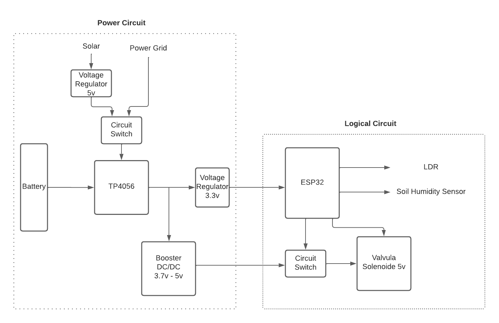

# Control plants irrigation using ESP32

A challenge made by Neurobots

# Overview

This project consist in creat a system that can irrigate plants based on day period and degree of humidity. This system have to be pownred by a battery of 3.7v 

### System

 In summary, the system is made to charge the battery with solar pannels or power grid (giving priority to the power grid), and power a ESP32 that will be the brain operation, that will decide if LDR and Soil Hmidity Sensor get in some state, will trigger the circuit switch to activate solenoide valvula.

### Power Circuit
lithium batteries can be dangerous if not charged properly and that's why the TP4056 is useful as it stops over voltage and current charging by detecting specific voltage conditions. You should never use the TP4056 as a charger and as a load driver at the same time. For this we will use a PMOSFET that will function like a controlled switch that disconnects the battery when external power is applied.
 The TP4056 still charges the battery but without a load. Power to the load is supplied from the power source directly.

### Logical Circuit

Both LDR and Sensor Humidity are analog devices, therefore can be atached to any ADC GPIO of ESP32.

For Activate the valvula solenoide, must be a output GPIO (anyone except 34, 35, 36, 39 because they are input only).

