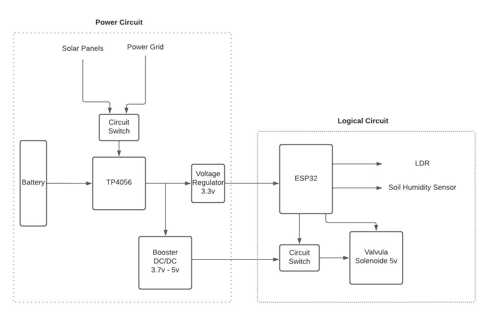

# Control plants irrigation using ESP32

A challenge made by Neurobots

# Overview

This project consist in creat a system that can irrigate plants based on day period and degree of humidity. This system have to be pownred by a battery of 3.7v 

### System

 In summary, the system is made to be charge with solar pannels or power grid (giving priority to the power grid), and the rest of the circuit is always plugged on the battery, with the TP4056 and load balancer, the battery is cut off if get ~2.4v. 

it's important to have a voltage regulator on the output of a solar pannel because of voltage floating, so if connects direct to a transistor, it will open and close the transistor every time the voltage float.
